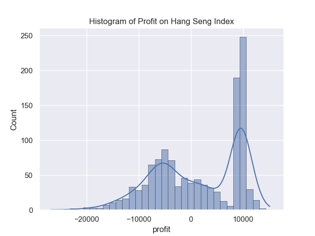
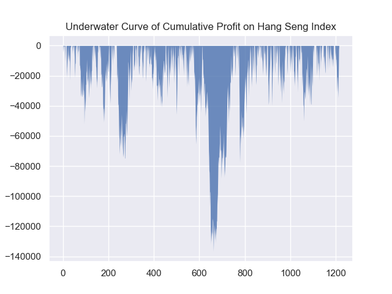
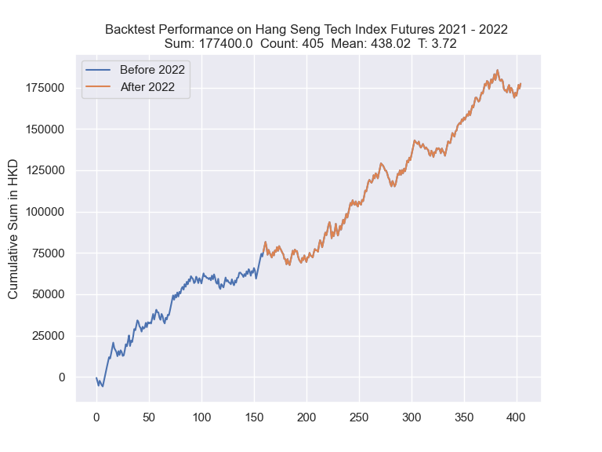
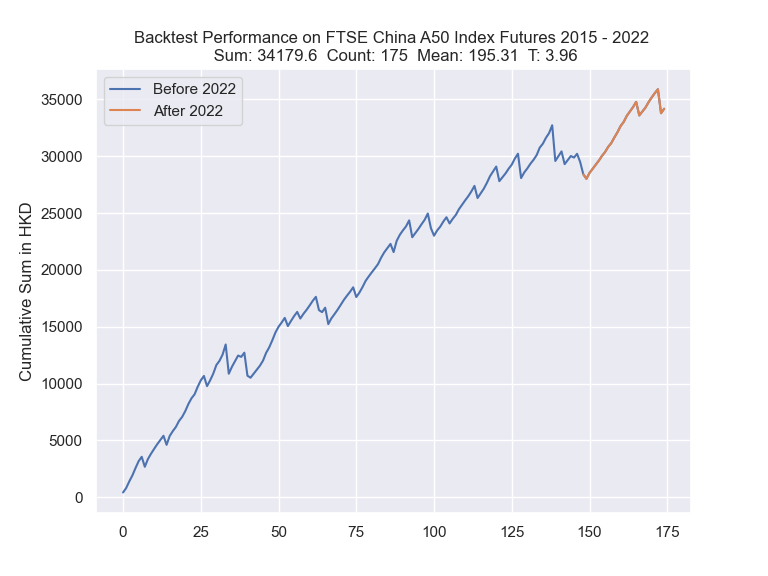

# TrueSignal
* Algorithm trading signal provider focus on Hang Seng Index
* Solid experience in Python and financial market with 5 years of algorithm trading experience 

# Services
* Provide profitable trading signals on various futures market
* Automated trading support
  * Strategy writing in Python / MultiCharts
  * Backtesting
  * Any coding problems on Python / MultiCharts

# Why TrueSignal
* Intraday trading 
  * Lower and limited risk compare to holding an overnight position 
* Easy to start
  * Only a few easy steps to start our strategies 
  * Fully automated, signals are generated on the server side to prevent any discrepancy
* Unique strategies
  * Based on robust price action
  * Not using any technical indicators
* Reliable and consistent trading performance
  * Our core HSI strategy has a t-statistic (Sharpe ratio) over 5 (without cost)

# Core strategy
Assume we trade 1 HSI futures contract, 1 pts = 50 HKD.

| Metrics                |               |
|------------------------|---------------|
| Total                  | 1,497,100 HKD |
| Mean                   | 1,232 HKD     |
| Std                    | 8,187 HKD     |
| MDD                    | 136,700 HKD   |
| Number of trade        | 1215          |
| T-statistic            | 5.25          |
| Win rate               | 54.7%         |
| Average holding period | 194 Minutes   |
| Long                   | 0%            |
| Short                  | 100%          |

| Profit by year | HKD     |
|----------------|---------|
| 2013           | 153,700 |
| 2014           | 58,700  |
| 2015           | 161,400 |
| 2016           | 165,700 |
| 2017           | 23,850  |
| 2018           | 121,950 |
| 2019           | 25,850  |
| 2020           | 214,500 |
| 2021           | 246,850 |
| 2022           | 324,600 |

# Other strategies

# Requirements
* [Python](https://www.python.org/) >= 3.7
  * [IBApi (Interactive Brokers API)](https://interactivebrokers.github.io/) >= 10.19
* [Interactive Brokers Account](https://www.interactivebrokers.com/en/home.php)

